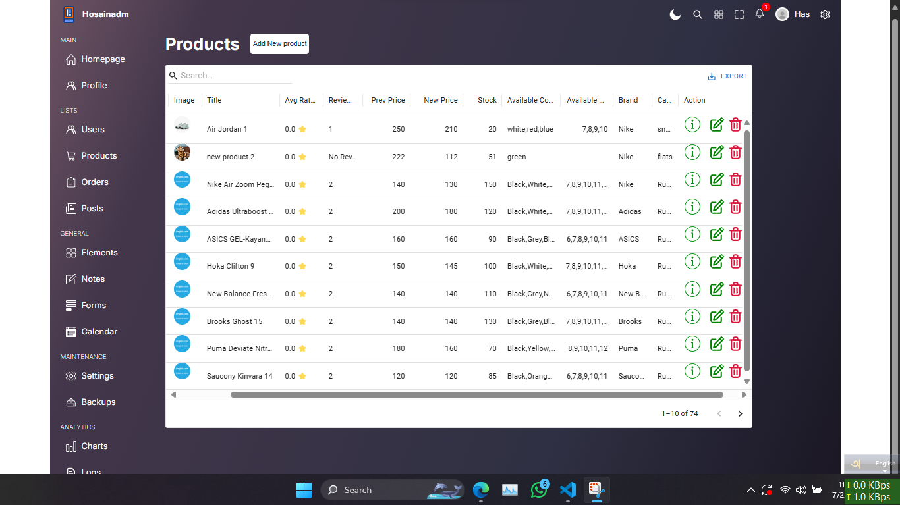

# React Admin Dashboard

A modern, responsive, and feature-rich admin dashboard built with React, TypeScript, MUI, React Query, Framer Motion, and Sass.  
This dashboard is designed for managing users, products, orders, analytics, and more, with a clean UI and robust code structure.

---

## Features

- **Authentication:** Secure login/signup flows with JWT.
- **User Management:** View, add, update, and delete users.
- **Product Management:** CRUD operations for products, including advanced input for sizes and colors.
- **Order Management:** Summarized and detailed order views, status updates, and responsive popups.
- **Analytics:** Interactive charts (Bar, Pie, Line) for users, products, and conversions.
- **Responsive Design:** Works seamlessly on desktop, tablet, and mobile.
- **Dark/Light Mode:** Toggle between themes.
- **Animations:** Smooth transitions using Framer Motion.
- **Reusable Components:** Data tables, charts, popups, forms, and more.
- **API Integration:** Uses Axios and React Query for efficient data fetching and mutation.

---

## Tech Stack

- **React 18**
- **TypeScript**
- **Vite** (fast dev/build)
- **MUI (Material UI)**
- **React Query**
- **Axios**
- **Framer Motion**
- **Sass (SCSS)**
- **Recharts**

---

## Project Structure

```
React Admin Dashboard/
├── public/
│   ├── *.svg, *.png           # Icons and images
│   └── ...                    # Other static assets
├── src/
│   ├── components/
│   │   ├── add/               # Add/Edit modal forms
│   │   ├── barChartBox/       # Bar chart analytics
│   │   ├── bigChartBox/       # Large chart analytics
│   │   ├── chartBox/          # Chart widgets
│   │   ├── dataTable/         # Data grid tables
│   │   ├── footer/            # Footer
│   │   ├── Logout/            # Logout button
│   │   ├── menu/              # Sidebar menu
│   │   ├── navbar/            # Top navigation bar
│   │   ├── orderDetailsPopup/ # Order details popup
│   │   ├── orderedItems/      # Ordered items list
│   │   ├── pieChart/          # Pie chart analytics
│   │   ├── single/            # Single item view
│   │   └── topBox/            # Top deals/users/products
│   ├── pages/
│   │   ├── home/              # Dashboard home
│   │   ├── login/             # Login page
│   │   ├── signup/            # Signup page
│   │   ├── products/          # Products management
│   │   ├── orders/            # Orders management
│   │   ├── users/             # Users management
│   │   └── posts/             # Posts management
│   ├── styles/                # Global and variables SCSS
│   ├── utilities/             # Context, helpers, etc.
│   ├── data.ts                # Demo/mock data
│   ├── App.tsx                # Main app entry
│   └── main.tsx               # Vite entry point
└── ...                        # Config files, README,
```

---

## Getting Started

### Prerequisites

- Node.js (v18+ recommended)
- npm or yarn

### Installation Instructions

Follow these steps to install and run this repository:

1. **Clone the repository**
   ```bash
   git clone https://github.com/yourusername/react-admin-dashboard.git
   cd react-admin-dashboard
   ```
2. **Install dependencies**
   ```bash
   npm install
   ```
3. **Start the backend server**

- If you are using the provided backend, navigate to the backend directory which is in a seperate repository, visit: https://github.com/cshosain/complete-e-commerce-shoe-shop-backend.git and follow the instructions of that repository to start the server. [Don't forget to update all api url from fronted, with your own backend url ]

### Running Locally

```bash
npm run dev
```

Open [http://localhost:5173](http://localhost:5173) in your browser.

### Building for Production

```bash
npm run build
```

1. **Preview Production Build**

```bash
npm run preview
```

---

## Environment Variables

- API endpoints are configured for local development (`http://localhost:3000/api/...`).
- JWT tokens are stored in `localStorage` under the key `jsonwebtoken`.

---

## Customization

- **Theme:** Easily switch between dark and light modes.
- **Charts:** Plug in your own analytics data via `src/data.ts` or API.
- **Forms:** Product and order forms support advanced input (e.g., tag/chip input for sizes/colors).

---

## Screenshots

|                    Dashboard Home (Light)                    |                   Dashboard Home (Dark)                    |
| :----------------------------------------------------------: | :--------------------------------------------------------: |
|  |  |

|                       Products List                        |                           Add Product                           |
| :--------------------------------------------------------: | :-------------------------------------------------------------: |
|  |  |

|                     Orders List                      |                           Order Details                            |
| :--------------------------------------------------: | :----------------------------------------------------------------: |
|  |  |

|                       Mobile View (Light)                        |                       Mobile View (Dark)                       |
| :--------------------------------------------------------------: | :------------------------------------------------------------: |
|  |  |

---

## License

This project is currently under development.  
**License:** MIT

---

## Contributing

Pull requests and issues are welcome!  
For major changes, please open an issue first to discuss what you would like to change.

---

## Contact

For questions or feedback, open an issue or contact [cshosain@gmail.com](mailto:your-email@example.com).

---

## TODO

- [ ] Add more API documentation
- [ ] Replace the current static charts data with actual analytics
- [ ] Add upgradetions of profile details (name, avatar, password, access management, etc.)
- [ ] Add language change option
- [ ] Add message and nofication handling
- [ ] Add deployment instructions

---

> \_If you need more details (API docs, deployment, etc.), let me know!\_
